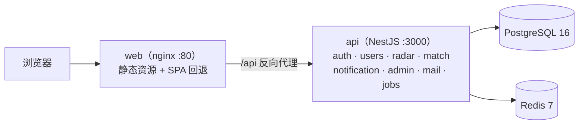

<div align="center">


# UESTC TeamUp

**成电人的竞赛罗盘** —— 电子科技大学校内竞赛信息与组队平台

[](https://nodejs.org/)
[](https://pnpm.io/)
[](https://nestjs.com/)
[](https://vuejs.org/)
[](https://www.postgresql.org/)
[](https://www.prisma.io/)

</div>

解决两个校园痛点：**竞赛信息支离破碎**（靠 QQ 群口口相传、容易错过 DDL），以及**论坛组队低效**（帖子沉底、状态不更新）。

- **竞赛雷达**：结构化竞赛档案 + 日历视图，「只看能加分的比赛」一键筛选
- **队友匹配**：结构化组队卡 + 队伍状态机 + 申请审批流，把沟通沉淀在站内
- 差异化护城河：**推免加分是独立字段**——级别回答「比赛多大」，加分回答「对我保研有没有用」（56 项认定清单源自校教学文件，随种子数据入库）

---

## 目录

- [功能特性](#功能特性)
- [技术栈](#技术栈)
- [架构](#架构)
- [仓库结构](#仓库结构)
- [快速开始](#快速开始)
- [常用命令](#常用命令)
- [测试](#测试)
- [生产部署](#生产部署)
- [文档索引](#文档索引)
- [开发规范](#开发规范)
- [路线图](#路线图)
- [许可](#许可)

## 功能特性

**竞赛雷达**

- 竞赛档案：级别（国际 / 国家 / 省 / 校四档多值）、报名 / 初赛 / 决赛时间线、推免加分认定
- 日历视图（FullCalendar）、全文搜索、收藏、「只看能加分的比赛」筛选
- 事后纠错：用户提交纠错 → 管理员采纳；改过的时间线节点 `isLocked` 锁定，未来自动采集不会覆盖人工结果；全字段变更入 `CrawlRevision`，后台一键回滚（回滚本身也留痕）
- DDL 定时提醒：赛前 7 / 3 / 1 天推送站内通知

**队友匹配**

- 组队卡「广告牌模式」，队伍状态机四态：招募中 / 已满员 / 已参赛 / 已解散
- `joinTeam` 原子事务 + 数据库不变量约束，杜绝超员 / 竞态
- **半匿名规则**（服务端序列化裁剪，前端不藏字段）：陌生人只见昵称 / 学院 / 年级 / 专业 / 技能；同队成员与管理员解锁学号与联系方式；联系方式仅在入队申请通过后可见
- 招募信息仅登录可见，游客看到整块磨砂玻璃引导

**平台能力**

- 双登录：邮箱验证码（首次即注册）+ 密码；dev 模式验证码打印到后端控制台并随响应回显
- 管理后台：竞赛编辑、来源 / 异常、纠错处理台、版本回滚、公告、举报、用户管理
- 品牌视觉：校徽深蓝 `#0F4C8C` + 银杏黄 `#F5B901` 玻璃拟态设计系统

## 技术栈

| 层 | 选型 |
|---|---|
| 后端 | NestJS 10 · Prisma 5 · PostgreSQL 16（pg_trgm 模糊搜索）· Redis 7（会话 / 验证码 / 限流） |
| 前端 | Vue 3 · Vite 5 · Pinia · Vue Router · Element Plus · UnoCSS · FullCalendar |
| 共享 | `packages/shared`：前后端枚举与类型单一来源（与 [docs/FIELDS.md](./docs/FIELDS.md) 对齐） |
| 工程 | pnpm workspace 单体 monorepo · TypeScript 5 · `node:test`（tsx 直跑） |
| 部署 | Docker Compose（nginx 静态 + `/api` 反代）· PG 参数按 2C2G 单机调优 |

## 架构



- 单体 + 模块化边界，**不做微服务**（2C2G 单机预算）
- API 全局前缀 `/api`，统一响应包装（`TransformInterceptor`）+ 全局异常过滤（`HttpExceptionFilter`）
- Cookie httpOnly 会话，CORS 白名单由 `WEB_ORIGIN` 控制
- cron 任务：DDL 提醒（7/3/1 天）+ 队伍状态归档（`apps/api/src/jobs/`）

## 仓库结构

```
.
├─ apps/
│  ├─ api/                # NestJS 10 + Prisma 5（:3000，全局前缀 /api）
│  │  ├─ src/common/      # 认证守卫 · Prisma/Redis · 拦截器 · 过滤器
│  │  ├─ src/modules/     # auth · users · mail · notification · radar · match · admin
│  │  ├─ src/jobs/        # DDL 提醒 + 队伍归档 cron
│  │  └─ prisma/          # schema · migrations · seed · extract_bonus.py · bonus-list.json
│  └─ web/                # Vue 3 + Vite（dev :5173，/api 代理到 :3000）
├─ packages/shared/       # 前后端共享枚举 / 类型
├─ docker/                # Dockerfile.api · Dockerfile.web（构建上下文 = 仓库根）
├─ deploy/                # docker-compose.yml · nginx.conf · pg.conf · .env.example
├─ scripts/               # 品牌素材加工（Python + Pillow）
├─ assets/brand/          # 校徽 / 线稿 / 银杏原始素材
├─ data/                  # competition-sites.csv（竞赛官网清单）
└─ docs/                  # 设计文档（唯一需求来源），入口 docs/README.md
```

## 快速开始

### 依赖环境

- Node.js ≥ 20，pnpm ≥ 9（`corepack enable` 即可）
- PostgreSQL 16+（需 `pg_trgm` 扩展）与 Redis 7+

### 步骤

```bash
# 1. 安装依赖
pnpm install

# 2. 配置后端环境变量
cp apps/api/.env.example apps/api/.env   # 按本地数据库修改

# 3. 准备数据库（任选一种）
#    a) Docker：docker compose -f deploy/docker-compose.yml up -d db redis
#       首次需建扩展：docker compose -f deploy/docker-compose.yml exec db \
#         psql -U teamup -d teamup -c "CREATE EXTENSION IF NOT EXISTS pg_trgm;"
#    b) WSL2 Ubuntu：wsl -d Ubuntu -e bash -c "systemctl start postgresql redis-server"

# 4. 构建共享包 → 迁移 → 种子数据
pnpm -F @teamup/shared build
pnpm db:migrate
pnpm db:seed        # 59 个竞赛（含 56 项推免认定清单）+ 演示用户 / 队伍

# 5. 启动开发（api :3000 与 web :5173 并行）
pnpm dev
```

打开 <http://localhost:5173>。

> **WSL2 提示**：`DATABASE_URL` 主机必须写 `127.0.0.1` 而非 `localhost`（WSL 中 PG 只监听 IPv4，Node 会先解析 `::1` 导致 P1001）。

### 演示账号（种子数据）

| 账号 | 密码 | 说明 |
|---|---|---|
| `2024080909015@std.uestc.edu.cn` | `123456789` | 管理员，登录后进 `/admin` 后台 |
| `2024080909000@std.uestc.edu.cn` | `123456789` | 普通测试用户 |
| 其余 4 个演示用户 | 无密码 | 验证码登录后在「个人中心」设置密码 |

dev 模式（`MAIL_PROVIDER=console`）下验证码打印在后端控制台并随响应 `dev.devCode` 回显；接入真实发信见 [路线图](#路线图)。

## 常用命令

| 命令 | 作用 |
|---|---|
| `pnpm dev` | 前后端并行开发（api watch / web vite） |
| `pnpm dev:api` / `pnpm dev:web` | 只起后端 / 只起前端 |
| `pnpm build` | 全量构建（web 含 `vue-tsc --noEmit` 类型检查） |
| `pnpm db:migrate` | Prisma 迁移（开发库） |
| `pnpm db:seed` | 重置并写入种子数据 |
| `pnpm -F @teamup/api test` | 后端测试（组队状态机等） |

## 测试

后端使用 `node:test` + tsx 直跑，无需额外测试框架：

```bash
pnpm -F @teamup/api test          # apps/api/test/teams.spec.ts
```

前端以 `vue-tsc` 类型检查作为构建门槛（`pnpm -F @teamup/web build` 内含）。

## 生产部署

```bash
cd deploy
cp .env.example .env              # 填写 POSTGRES_PASSWORD、COOKIE_SECRET（64 位随机）
docker compose up -d --build

# 首次部署 / 升级后同步 schema
docker compose exec api npx prisma migrate deploy
```

- 内存预算（2C2G）：PG `shared_buffers=256MB`（`deploy/pg.conf`）、API 限 320M、Redis 48M、nginx 64M
- HTTPS：建议前置 Caddy 或 certbot；国内服务器 + 域名需 **ICP 备案**
- 真实发信：`.env` 中 `MAIL_PROVIDER=qq` + QQ 邮箱 16 位 SMTP 授权码（个人邮箱有每日发信限额，上线前实测送达率）

## 文档索引

设计文档位于 `docs/`，是**唯一需求来源**；入口与维护规则见 [docs/README.md](./docs/README.md)。

| 文档 | 内容 |
|---|---|
| [TECH_STACK.md](./docs/TECH_STACK.md) | 技术选型理由、内存预算、部署、依赖清单 |
| [DATA_MODEL.md](./docs/DATA_MODEL.md) | 表设计、关系、枚举、Prisma schema |
| [FIELDS.md](./docs/FIELDS.md) | 字段清单（可编辑）：展示 / 编辑 / 必填口径 |
| [PAGES.md](./docs/PAGES.md) | 信息架构、路由表、页面要素与交互 |
| [MODULE_AUTH.md](./docs/MODULE_AUTH.md) | 登录与邮件技术路线 |
| [MODULE_MATCH.md](./docs/MODULE_MATCH.md) | 队友匹配技术路线 |
| [MODULE_CRAWLER.md](./docs/MODULE_CRAWLER.md) | 采集子系统设计（未实现，接缝见路线图） |
| [ROADMAP.md](./docs/ROADMAP.md) | 阶段划分、任务拆解、验收标准 |
| [OPEN_QUESTIONS.md](./docs/OPEN_QUESTIONS.md) | 待澄清事项与已知矛盾 |

## 开发规范

分支模型、Conventional Commits 中文摘要规范、数据模型变更流程与 PR 自检清单见 [CONTRIBUTING.md](./CONTRIBUTING.md)。

## 路线图

- ✅ **P1 平台地基**：注册登录（验证码 / 密码）、竞赛雷达、组队状态机、管理后台、DDL 提醒
- 🔜 **真实邮件发送**：接缝已留——实现 `apps/api/src/modules/mail/qq-smtp.provider.ts`，`.env` 切 `MAIL_PROVIDER=qq`；限流 / 防枚举 / 会话已就绪
- 🔜 **自动采集**：表结构（`CrawlSource/Snapshot/Item/Anomaly/Revision`）与安全带（纠错处理台、版本回滚）已就绪，按 [MODULE_CRAWLER](./docs/MODULE_CRAWLER.md) §10 顺序补 fetcher → parser → matcher → guard → publisher；竞赛官网清单见 `data/competition-sites.csv`
- 💤 **智能匹配**：冷启动期数据密度不足，P3 再评估

## 数据与素材说明

- **推免加分**：56 项认定清单提取自《校教〔2026〕39 号》文（原件存 `data/`，不入库），提取脚本 `python apps/api/prisma/extract_bonus.py > apps/api/prisma/bonus-list.json`
- **品牌素材**：`assets/brand/` 原始 PNG 经 `python scripts/prepare_brand_assets.py` 加工输出到 `apps/web/public/brand/`；校训「求实求真 · 大气大为」以文字排版呈现于登录页与页脚
- 校徽、校名等标识版权归电子科技大学所有，本项目仅用于校内公益平台

## 许可

本仓库未附加开源许可证，**保留所有权利（All Rights Reserved）**。
